# Res'O Vélo Orléans Métropole  - projet QField.

'ResOvelo_OM_VE.zip' est un fichier de projet pour l'application [QField](https://qfield.org/) qui vous permetra de suivre les différents itinéraires des propositions d’aménagements pour le Rés’O Vélo Orléans Métropole de l'association [DAMMO](https://www.dammo.fr/r%C3%A9so-v%C3%A9lo) sur votre smartphone avec un positionnement automatique sur l'écran, le niveau de zoom et l'orientation que vous désirez, ainsi que le choix du fond de carte OpenStreetMap ou Topo.

Un tracé de la route empruntée peut être affichée aussi en bleu par dessus les tracés existants.

Les fonds de carte sont affichés 'en ligne' avec une connexion internet active consommant peu de données.

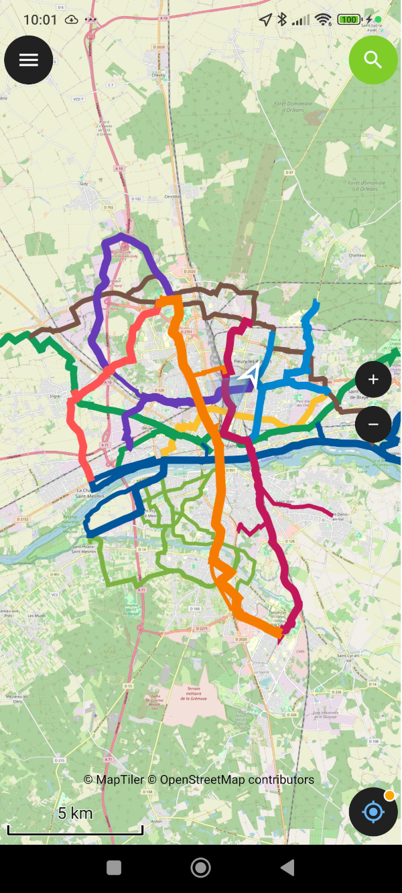

## Utilisation du projet ResOvelo_OM_VE avec l'application QField pour smartphone.

Télécharger le fichier du projet  en utilisant le bouton 'download raw file' à droite de la ligne.
Le fichier 'ResOvelo_OM_VE.zip' ne fait que quelques dizaines de Ko.

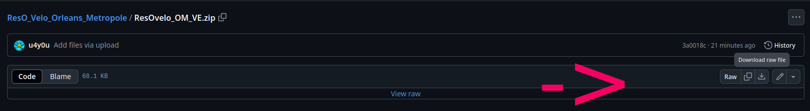

### Première utilisation - installation du fichier du projet dans l'application QField.

Télécharger QField sur votre store (Android, iOS, Windows, Linux, MacOS) et lancer QField:

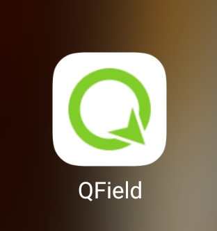

Utiliser le bouton 'Ouvrir un fichier local':

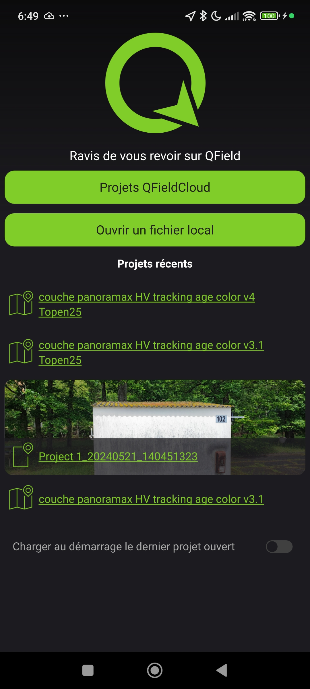

Utiliser le bouton vert '+' en bas à droite pour choisir le projet précédemment téléchargé à importer ...

Choisir Importer depuis le ZIP dans le menu 

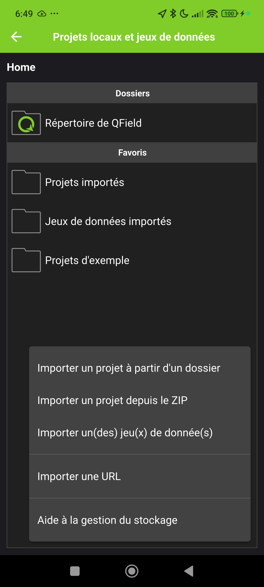

Se déplacer dans le dossier ou est stocké le fichier téléchargé  'ResOvelo_OM_VE.zip' et cliquer dessus pour le charger dans l'application...

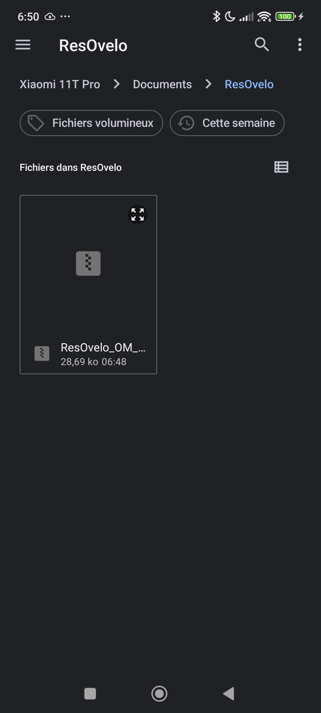

Le projet s'affiche avec les couches composant les Jeux de données
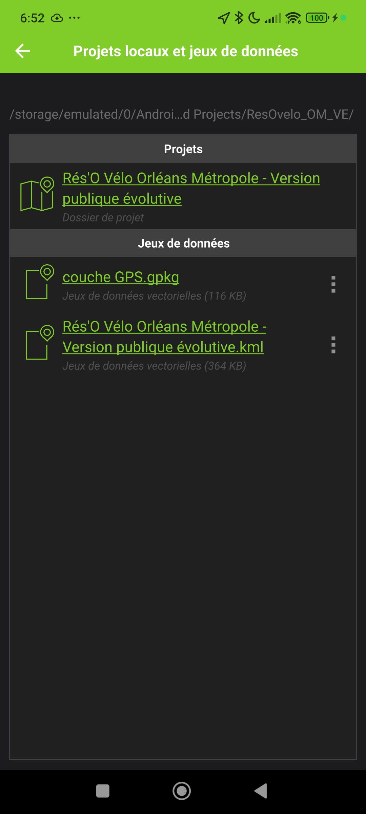

Valider en haut à gauche avec ✅️

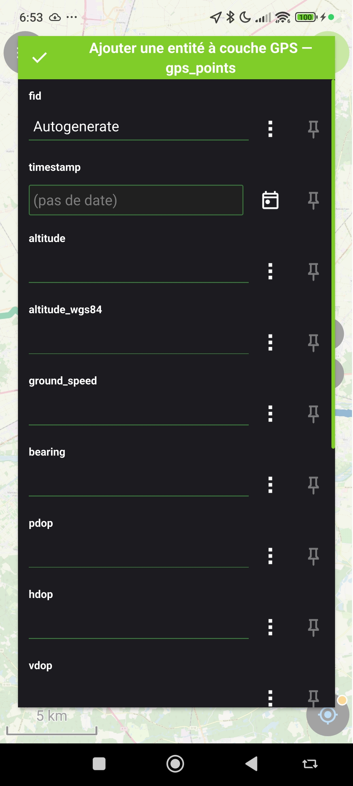

La carte s'affiche alors. Le bouton GPS bleu en bas à droite permet de centrer la carte sur votre position actuelle et les boutons zoom + et - permettent de régler le niveau de zoom de l'affichage. Le bouton noir en haut à gauche est le menu.

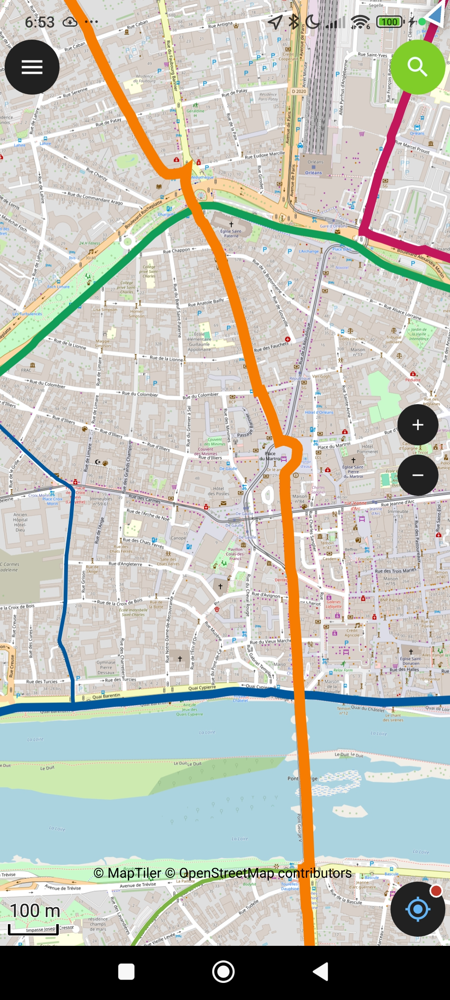

Via le bouton du menu en haut à gauche, on peut sélectionner les couches à afficher. Une icône 👁️‍🗨️️ en face du nom de chacune des couches permet d'afficher ou d'invisibiliser la couche.
Par défaut le fond de carte est OpenStreetMap (dernière couche en bas de la liste) et la trace GPS bleue 🔵️ (première couche en haut de liste) est activée.

Zoom sur la couche OSM:

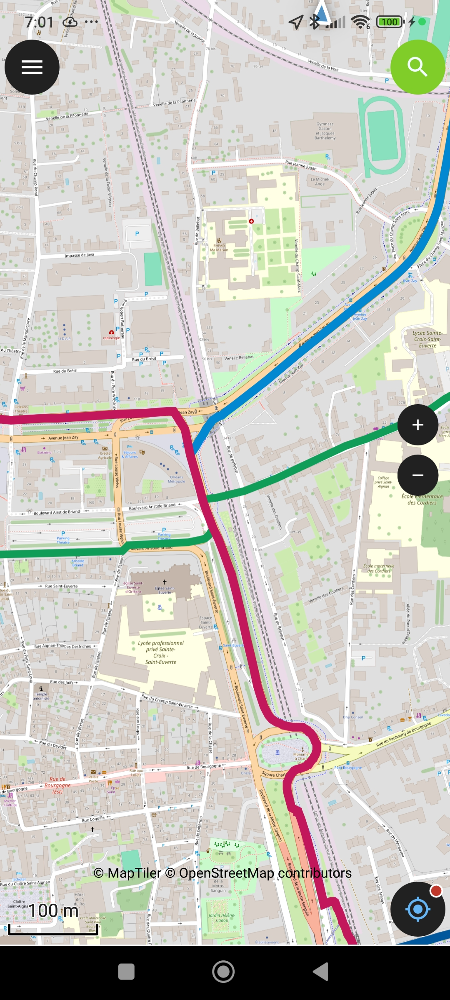

On peut changer la couche de fond pour un style Topo en activant la visualisation de la couche Topen25 et en masquant la couche OSM

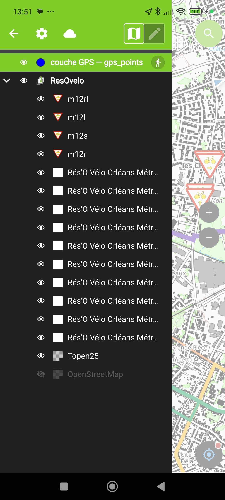

Zoom sur la couche Topen25:

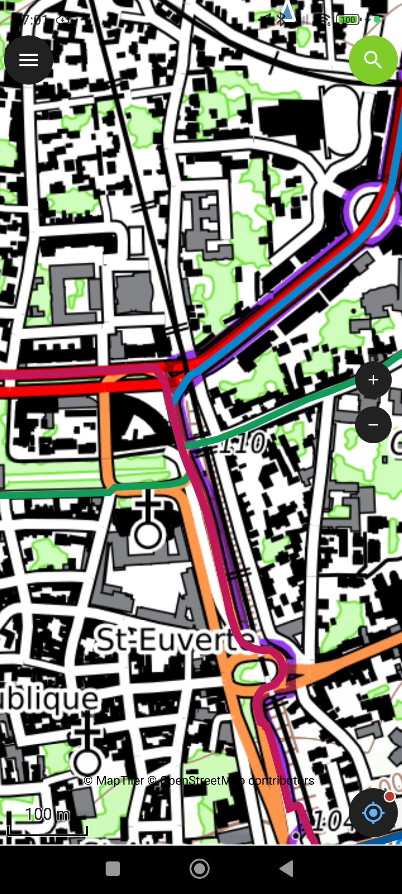

Le bouton GPS bleu en bas à droite est par défaut sur fond noir et permet de déplacer le fond de carte en le faisant glisser sur l'écran tactile et en zoomant.

Un appuie sur le bouton GPS fait passer le fond en bleu et recentre la carte sur votre position.

Un deuxieme appuie permet de suivre l'orientation de la bousole et la fait apparaitre en bas à gauche tout en modifiant l'orientation du fond de carte.

Un appuie sur l'icône de la boussole en bas à gauche redresse l'orientation de la carte avec le Nord en haut de l'écran.

Pour revenir en mode de non suivi GPS, il suffit de faire glisser le fond de carte sur l'écran tactile et le fond de l'icône du bouton GPS repasse en noir.

Un nouvel appuie relance le suivi et le centrage et recommence le cycle.

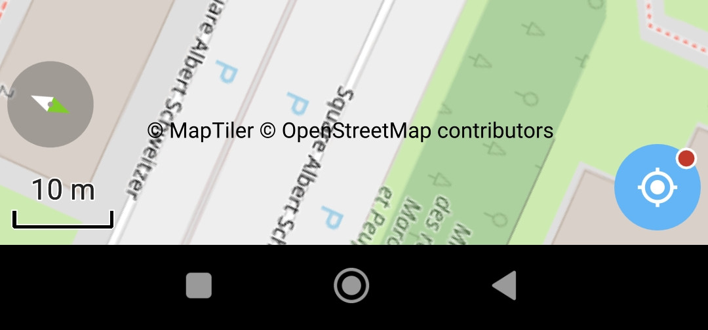

