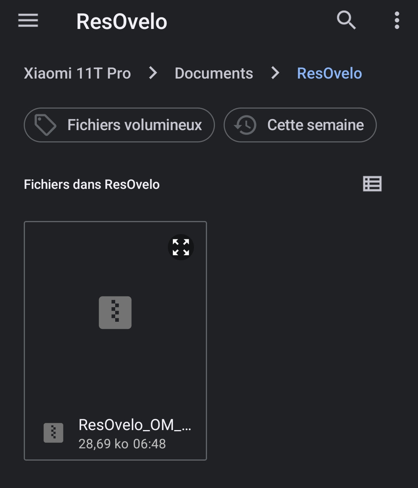

# Res'O Vélo Orléans Métropole

Utilisation du projet ResOvelo_OM_VE avec l'application QField pour smartphone.

Première utilisation - installation du fichier du projet dans l'application QField.
Lancer QField:

Utiliser le bouton 'Ouvrir un fichier local':

Utiliser le bouton '+' en bas à droite...

Choisir Importer depuis le ZIP dans le menu

Se déplacer dans le dossier ou est stocké le fichier 'ResOvelo_OM_VE.zip' et cliquer dessus pour le charger dans l'application...

Le projet s'affiche avec les couches composant les Jeux de données

Valider en haut à gauche avec ✅️

La carte s'affiche alors. Le bouton GPS bleu en bas à droite permet de centrer la carte sur votre position actuelle et les boutons zoom + et - permettent de régler le niveau de zoom de l'affichage. Le bouton noir en haut à gauche est le menu.

Via le bouton du menu en haut à gauche, on peut selectionner les couches à afficher. Une icône en face du nom de chacune des couches permet d'afficher ou d'invisibiliser la couche.
Par défaut le fond de carte est OpenStreetMap (dernière couche en bas de la liste)

Zoom sur la couche OSM.

On peut changer la couche de fond pour un style Topo en activant la visualisation de la couche Topen25 et en masquant la couche OSM

Zoom sur la couche Topen25

